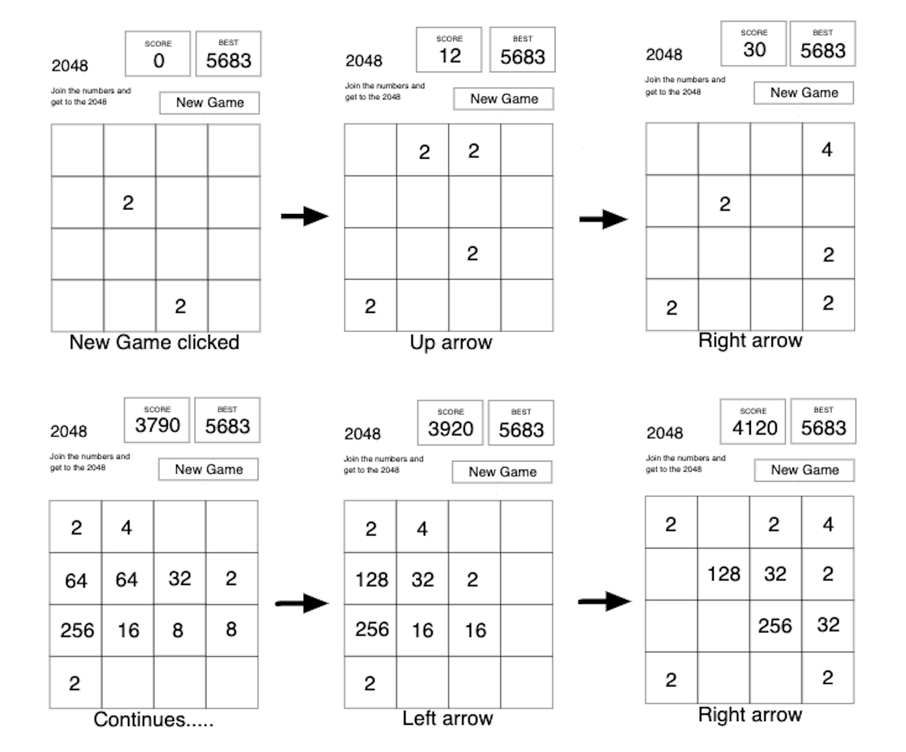

# 2048

## Overview
- 2048 is a single-player sliding tile puzzle video game written by Italian web developer Gabriele Cirulli and published on GitHub. The objective of the game is to slide numbered tiles on a grid to combine them to create a tile with the number 2048; however, one can continue to play the game after reaching the goal, creating tiles with larger numbers. It was originally written in JavaScript and CSS over a weekend, and released on 9 March 2014 as free and open-source software subject to the MIT License.

## User Stories
- A user clicks the 'New Game' button.
- A user will hit the arrow keys on the keyboard to move the tiles.
- The board will have the one random number (2 or 4) at random spot.
- A user wins if one of the numbers reach 2048.
- A user loses if the board fills up without 2048.

## Wireframes

## Stretch Goals
- Make the 'hard mode' to reach 4096
- Add sound effects when the same numbers match